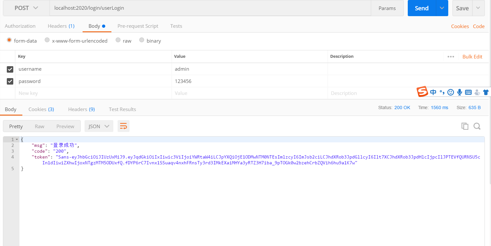

# spring-boot-security-demo

## 一、项目介绍:
SpringBoot整合security示例实现权限注解+JWT登录认证(数据库中测试号的密码进行了加密,密码皆为123456)

登录请求URL为:
localhost:2020/login/userLogin

请求示例如下:

## 二、数据脚本(SQL脚本在项目中sql目录下，名字叫my_security.sql)

## 三、如果有其它问题，欢迎提Issue